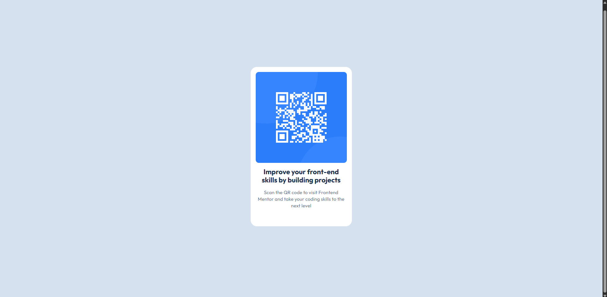
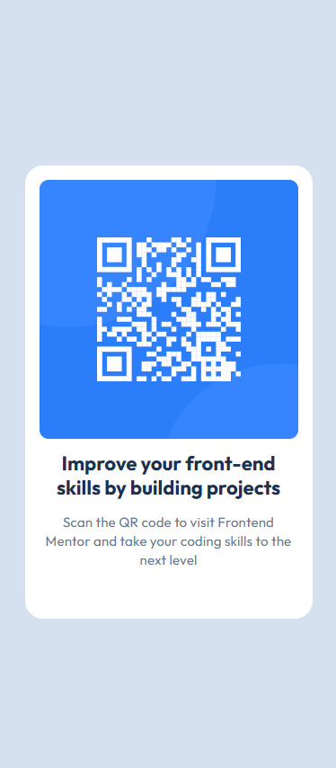

# Frontend Mentor - QR code component solution

This is my solution to the [QR code component challenge on Frontend Mentor](https://www.frontendmentor.io/challenges/qr-code-component-iux_sIO_H). Challenges provided by Frontend Mentor offer an opportunity to enhance coding skills by building practical applications. 

## Table of contents

- [Frontend Mentor - QR code component solution](#frontend-mentor---qr-code-component-solution)
  - [Table of contents](#table-of-contents)
  - [Overview](#overview)
    - [Screenshot](#screenshot)
    - [Links](#links)
  - [My process](#my-process)
    - [Built with](#built-with)
    - [What I learned](#what-i-learned)
    - [Continued development](#continued-development)
    - [Useful resources](#useful-resources)
  - [Author](#author)

## Overview

This marks a significant first step into Frontend Mentor Challenges. Despite its simplicity, it has provided a valuable opportunity to apply web development knowledge. Cards are common elements in web design, and while I had previously built many of them in Figma, coding them proved to be quite enlightening.
I gained practical experience with semantic HTML, the Flexbox model, and utilizing a basic design system from a Figma file. This helped me understand the entire process, from design and design token creation to developer handoff and finally, writing the HTML and CSS.

### Screenshot

### Links

- Solution URL: [QR Code Component Repository](https://github.com/victorudesa/frontend-mentor-challenges/tree/main/01-qr-code-component)
- Live Site URL: [QR Code Component Page](https://victorudesa.github.io/frontend-mentor-challenges/01-qr-code-component/)

## My process

First, I studied the provided Figma project, which included design tokens and styles, then I recreated it from scratch to ensure full comprehension.
Next, I utilized Figma's 'Dev Mode' to see the HTML and CSS equivalents of the design and to confirm my assumptions (e.g., how Auto Layout corresponds to the Flexbox model).Afterward, I focused on writing the HTML structure, prioritizing semantic elements and simplicity.
Lastly, I styled it with CSS, aiming to replicate the provided Figma design accurately.

### Built with

- Semantic HTML5 markup
- CSS custom properties
- Flexbox

### What I learned

* This challenge provided valuable practical experience.
* I reinforced my understanding of semantic HTML and the Flexbox model, essential for structuring and laying out web content effectively.
* Additionally, I learned how to implement responsive design, ensuring the layout adapts seamlessly across different devices.
* Working with CSS custom properties also enhanced my ability to manage design tokens and maintain consistency, making the styling process more efficient.

### Continued development

For continued development, I plan to incorporate CSS resets into my workflow to ensure consistent styling across browsers. I also aim to gain proficiency with CSS Grid Layout and further explore working with design systems to build more scalable and maintainable projects.

### Useful resources

- [MDN - Flexbox](https://developer.mozilla.org/en-US/docs/Learn_web_development/Core/CSS_layout/Flexbox) - MDN is a cornerstone reference in web development, especially for best practices. This article, like many others from their website, made Flexbox a lot clearer.
- [W3 - CSS Variables](https://www.w3schools.com/css/css3_variables.asp) - The W3C is also a huge reference, and it's beneficial to draw knowledge from different sources.
- [Design Systems](https://www.designsystems.com/)

## Author

- [GitHub](https://github.com/victorudesa)
- [Behance](https://www.behance.net/victorurdesa)
- [LinkedIn](https://www.linkedin.com/in/victorudesa/)