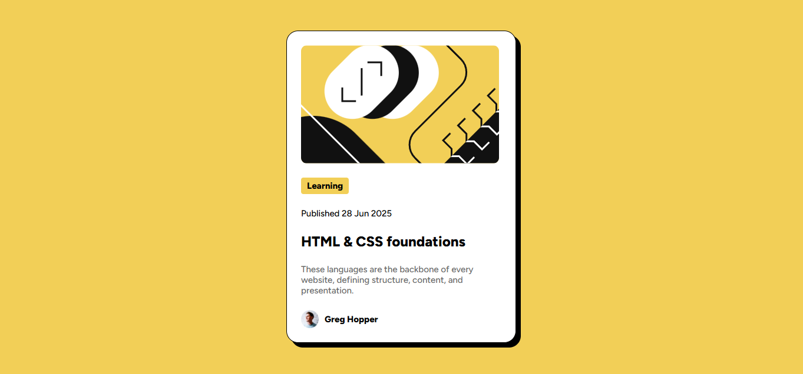
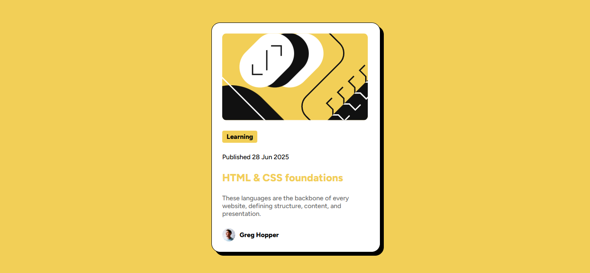
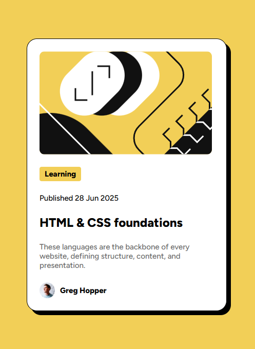

# Frontend Mentor - Blog Preview Card

Hello, I'm Victor!
This is my solution to the [Blog preview card challenge](https://www.frontendmentor.io/challenges/blog-preview-card-ckPaj01IcS). Challenges provided by Frontend Mentor offer an opportunity to enhance coding skills by building practical applications. 

## Table of contents

- [Frontend Mentor - Blog Preview Card](#frontend-mentor---blog-preview-card)
  - [Table of contents](#table-of-contents)
  - [Overview](#overview)
    - [Screenshot](#screenshot)
    - [Links](#links)
  - [My process](#my-process)
    - [Built with](#built-with)
    - [What I learned](#what-i-learned)
    - [Continued development](#continued-development)
    - [Useful resources](#useful-resources)
  - [Author](#author)

## Overview

This is my second Frontend Mentor challenge project, and even though it was similar to the first, I was glad to see progress already. Not only was I able to identify errors more quickly, but also to develop solutions and think more creatively.

I recreated the project in Figma before transitioning to HTML/CSS. I then utilized the Flexbox model, consistently prioritizing well-organized code. Additionally, I recreated and studied how to effectively apply design tokens from Figma within my CSS stylesheet.

### Screenshot

* 
* 
* 

### Links

- Solution URL: [Blog Preview Card Repository](https://github.com/victorudesa/frontend-mentor-challenges/tree/main/blog-preview-card)
- Live Site URL: [Blog Preview Card Page](https://victorudesa.github.io/frontend-mentor-challenges/blog-preview-card/)

## My process

I kicked off this challenge by rebuilding the design in Figma, just like last time, to really get a feel for it. Figma's Dev Mode was super helpful again for figuring out how the design would translate to HTML and CSS.
Then, I moved on to coding, making sure my HTML was semantic and clean. For the CSS, besides matching the design, I focused more on organizing my styles better and using design tokens efficiently. This felt much smoother than the first project.

### Built with

- Semantic HTML5 markup
- CSS custom properties
- Flexbox

### What I learned

* This challenge gave me even more hands-on practice with the Flexbox model and CSS custom properties, which felt great.
* A big win for me was really refining my CSS organization and getting a much better grasp on integrating Figma's design tokens. It made my styling workflow feel a lot more efficient and consistent. 
* I also got to experiment with a basic CSS reset (like border-box and zeroing out margins), which is something I'm keen to incorporate more.
* Lastly, I configured a hover interection for the first time.

### Continued development

* I plan to continue applying CSS resets in my projects and explore other well-known reset methodologies.
* Additionally, I aim to experiment further with Flexbox properties I haven't yet fully utilized, expanding my layout capabilities.

### Useful resources

- [MDN - Flexbox](https://developer.mozilla.org/en-US/docs/Learn_web_development/Core/CSS_layout/Flexbox) - MDN is a cornerstone reference in web development, especially for best practices. This article, like many others from their website, made Flexbox a lot clearer.
- [W3 - CSS Variables](https://www.w3schools.com/css/css3_variables.asp) - The W3C is also a huge reference, and it's beneficial to draw knowledge from different sources.
- [Design Systems](https://www.designsystems.com/)
- [CSS Minimal Reset](https://www.digitalocean.com/community/tutorials/css-minimal-css-reset)

## Author

- [GitHub](https://github.com/victorudesa)
- [Behance](https://www.behance.net/victorurdesa)
- [LinkedIn](https://www.linkedin.com/in/victorudesa/)