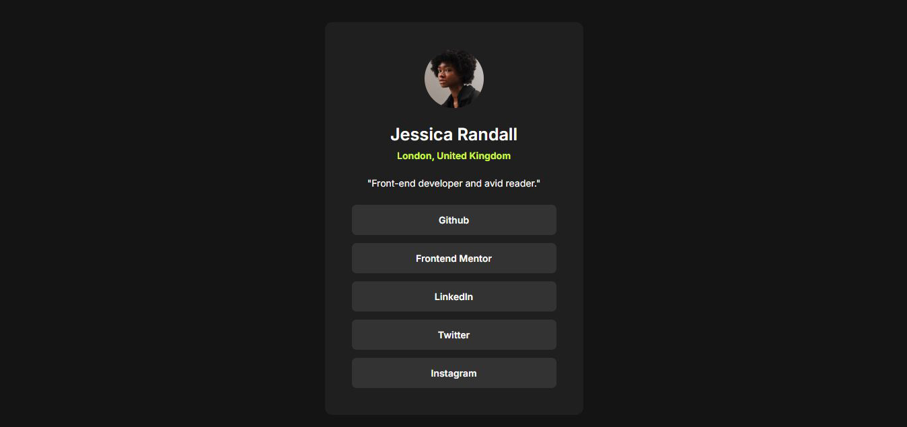
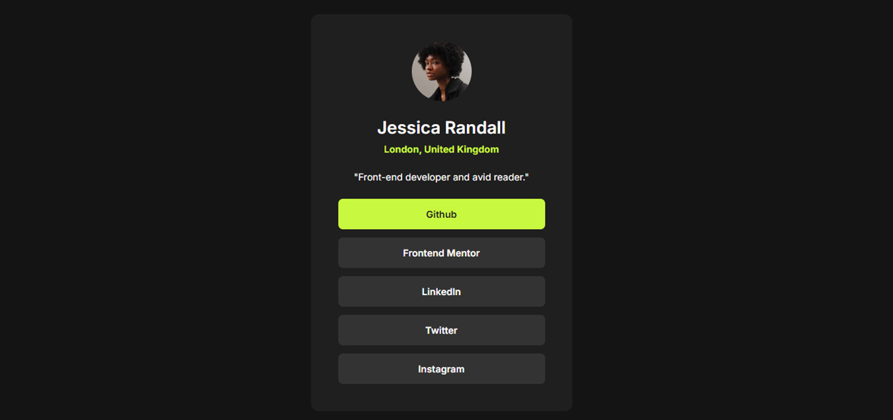
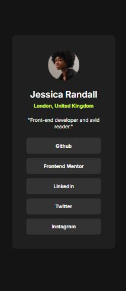

# Frontend Mentor Challenges - Social Links Profile Solution

Hello, I'm Victor!
This is my solution to the [Social Links Profile Challenge](https://www.frontendmentor.io/challenges/social-links-profile-UG32l9m6dQ). Challenges provided by Frontend Mentor offer an opportunity to enhance coding skills by building practical applications. 

## Table of contents

- [Frontend Mentor Challenges - Social Links Profile Solution](#frontend-mentor-challenges---social-links-profile-solution)
  - [Table of contents](#table-of-contents)
  - [Overview](#overview)
    - [Screenshot](#screenshot)
    - [Links](#links)
  - [My process](#my-process)
    - [Built with](#built-with)
    - [What I learned](#what-i-learned)
    - [Continued development](#continued-development)
    - [Useful resources](#useful-resources)
  - [Author](#author)

## Overview

This is my third Frontend Mentor challenge project, and it truly allowed me to dive deeper into Flexbox and refine my coding practices. I specifically focused on applying the DRY (Don't Repeat Yourself) principle to write cleaner, more efficient code.
This project also served as a great opportunity to practice working with the Figma file more quickly, speeding up my design-to-code workflow. A significant step forward for me was successfully implementing @media queries for the first time to improve responsiveness, a simple yet impactful addition that I'm proud of.

### Screenshot

* 
* 
* 

### Links

- Solution URL: [Blog Preview Card Repository](https://github.com/victorudesa/frontend-mentor-challenges/tree/main/03-social-links-profile)
- Live Site URL: [Blog Preview Card Page](https://victorudesa.github.io/frontend-mentor-challenges/03-social-links-profile/)

## My process

I began this challenge, as usual, by recreating the design in Figma. This time, I paid closer attention to practicing Auto Layout and setting up variables within Figma, which further streamlined the design-to-code process.
Then, I coded the HTML, focusing heavily on semantic structure. For the CSS, I continued leveraging design tokens (CSS custom properties) and implemented a :hover pseudo-class for the interactive elements for the first time, incorporating a smooth CSS transition property to enhance the user experience.

### Built with

- Semantic HTML5 markup
- CSS custom properties
- Flexbox
- Simple CSS Reset
- @media queries
- :hover pseudo-class with CSS transition

### What I learned

* Deepened my understanding and application of Flexbox for creating clean and responsive layouts.
* Further refined my CSS organization and actively practiced the DRY (Don't Repeat Yourself) principle by effectively using CSS custom properties (design tokens), leading to cleaner and more maintainable stylesheets.
* Successfully implemented a simple CSS reset for better cross-browser consistency, which I plan to continue integrating into future projects.
* Gained hands-on experience with @media queries to adapt the design for different screen sizes, marking my first successful attempt at basic responsiveness.
* Configured interactive :hover effects for the first time, utilizing the CSS transition property to create a smooth and engaging user experience.

### Continued development

* I plan to continue applying and exploring various CSS reset methodologies in my projects.
* Additionally, I aim to experiment further with advanced Flexbox properties and begin exploring CSS Grid for more complex layout challenges.
* I will focus on implementing more sophisticated responsive design patterns beyond basic @media queries to ensure robust adaptability across all devices.

### Useful resources

- [MDN - Flexbox](https://developer.mozilla.org/en-US/docs/Learn_web_development/Core/CSS_layout/Flexbox) - MDN is a cornerstone reference in web development, especially for best practices. This article, like many others from their website, made Flexbox a lot clearer.
- [W3 - CSS Variables](https://www.w3schools.com/css/css3_variables.asp) - The W3C is also a huge reference, and it's beneficial to draw knowledge from different sources.
- [Design Systems](https://www.designsystems.com/)
- [CSS Minimal Reset](https://www.digitalocean.com/community/tutorials/css-minimal-css-reset)

## Author

- [GitHub](https://github.com/victorudesa)
- [Behance](https://www.behance.net/victorurdesa)
- [LinkedIn](https://www.linkedin.com/in/victorudesa/)