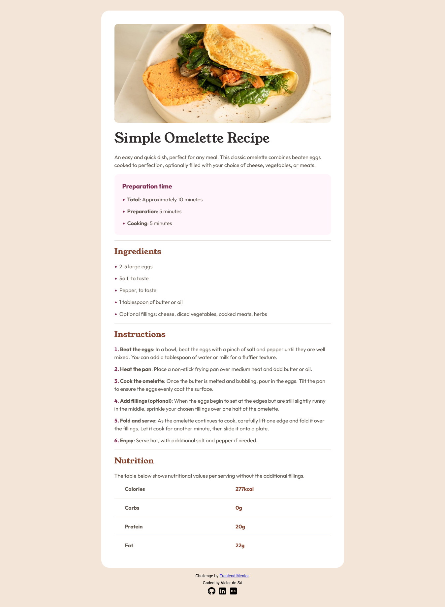
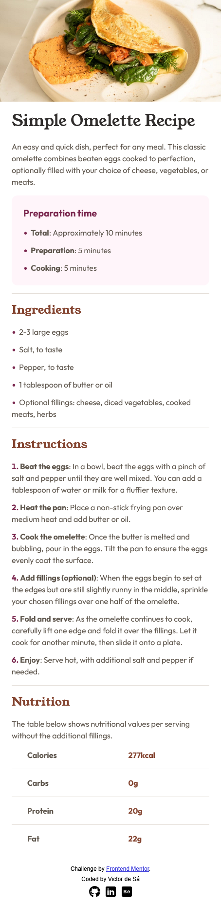

# Frontend Mentor Challenges - Recipe Page Solution

Hello, I'm Victor!
This is my solution to the [Recipe Page Challenge](https://www.frontendmentor.io/challenges/recipe-page-KiTsR8QQKm). Challenges provided by Frontend Mentor offer an opportunity to enhance coding skills by building practical applications. 

## Table of contents

- [Frontend Mentor Challenges - Recipe Page Solution](#frontend-mentor-challenges---recipe-page-solution)
  - [Table of contents](#table-of-contents)
  - [Overview](#overview)
    - [Screenshot](#screenshot)
    - [Links](#links)
  - [My process](#my-process)
    - [Built with](#built-with)
    - [What I learned](#what-i-learned)
    - [Continued development](#continued-development)
    - [Useful resources](#useful-resources)
  - [Author](#author)

## Overview

This marks my fourth Frontend Mentor challenge. I'm excited by the noticeable increase in development speed this project demonstrated, building upon my previous experiences. I actively focused on refining my understanding of Semantic HTML and Media Queries, leading to a more efficient and robust solution overall.

### Screenshot

* 
* 

### Links

- Solution URL: [Recipe Page Repository](https://github.com/victorudesa/frontend-mentor-challenges/tree/main/04-recipe-page)
- Live Site URL: [Recipe Page - Live Page](https://victorudesa.github.io/frontend-mentor-challenges/04-recipe-page/)

## My process

My process began with recreating the design in Figma, helping to map out the structure effectively. The HTML phase prioritized building a robust semantic foundation. For the CSS, I consistently leveraged design tokens and particularly focused on enhancing my use of Media Queries, resulting in a quicker and more adaptable solution.

### Built with

- Semantic HTML5 markup
- CSS custom properties
- Flexbox
- Simple CSS Reset
- @media queries
- Pseudo-classes (::marker and :last-child)

### What I learned

* Reinforced and enhanced my proficiency in Semantic HTML and accessible practices, ensuring a robust document structure.
* Significantly deepened my practical application of Media Queries for building fully responsive designs across various screen sizes.
* Further refined my CSS organization, leveraging custom properties (design tokens) for efficiency and maintainability.
* Successfully implemented local font imports using @font-face, optimizing performance and control over typography.

### Continued development

* My next development phase will focus heavily on architecting CSS using ITCSS (Inverted Triangle CSS) and rigorously applying the BEM (Block-Element-Modifier) naming convention to all components.
* This will further enhance my ability to build sophisticated and maintainable responsive designs, including continued exploration of CSS Grid for complex layouts.

### Useful resources

- [MDN - Flexbox](https://developer.mozilla.org/en-US/docs/Learn_web_development/Core/CSS_layout/Flexbox) - MDN is a cornerstone reference in web development, especially for best practices. This article, like many others from their website, made Flexbox a lot clearer.
- [W3 - CSS Variables](https://www.w3schools.com/css/css3_variables.asp) - The W3C is also a huge reference, and it's beneficial to draw knowledge from different sources.
- [Design Systems](https://www.designsystems.com/)
- [CSS Minimal Reset](https://www.digitalocean.com/community/tutorials/css-minimal-css-reset)

## Author

- [GitHub](https://github.com/victorudesa)
- [Behance](https://www.behance.net/victorurdesa)
- [LinkedIn](https://www.linkedin.com/in/victorudesa/)