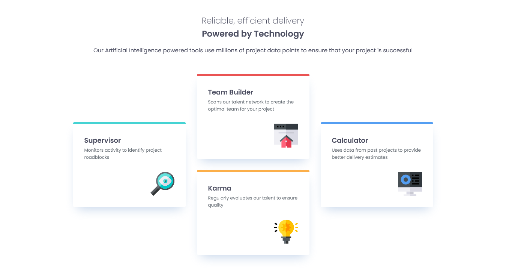
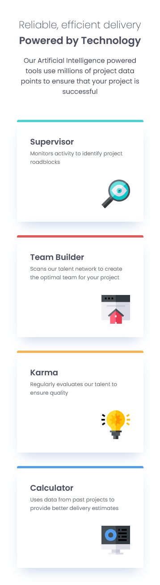

# Frontend Mentor Challenges - Four-Card Feature Solution

Hi, I'm Victor!
This is my solution to the [Four-Card Feature Challenge](https://www.frontendmentor.io/challenges/four-card-feature-section-weK1eFYK).

## Table of contents

- [Frontend Mentor Challenges - Four-Card Feature Solution](#frontend-mentor-challenges---four-card-feature-solution)
  - [Table of contents](#table-of-contents)
  - [Overview](#overview)
    - [Screenshot](#screenshot)
    - [Links](#links)
    - [Built with](#built-with)
    - [What I learned](#what-i-learned)
    - [Continued development](#continued-development)
    - [Useful resources](#useful-resources)
  - [Author](#author)

## Overview

In this challenge, I wanted to practice speed and focus on building a clean and professional solution. I continued leveraging the BEM and ITCSS methodologies to structure my CSS, and I successfully implemented CSS Grid for the first time to handle the three-column responsive layout.

### Screenshot

### Links

- Solution URL: [Product Preview Card Component Solution Repository](https://github.com/victorudesa/frontend-mentor-challenges/tree/main/05-product-preview-card-component/)
- Live Site URL: [Product Preview Card Component Solution - Live Page](https://victorudesa.github.io/frontend-mentor-challenges/05-product-preview-card-component/)

### Built with

- Semantic HTML5 markup
- CSS custom properties
- Flexbox
- Simple CSS Reset
- @media queries
- Pseudo-classes (::marker and :last-child)

### What I learned

* Reinforced and enhanced my proficiency in Semantic HTML and accessible practices, ensuring a robust document structure.
* Significantly deepened my practical application of Media Queries for building fully responsive designs across various screen sizes.
* Enhanced CSS architecture with BEM and ITCSS.

### Continued development

* My next development phase will focus heavily on architecting CSS using ITCSS (Inverted Triangle CSS) and rigorously applying the BEM (Block-Element-Modifier) naming convention to all components.
* This will further enhance my ability to build sophisticated and maintainable responsive designs, including continued exploration of CSS Grid for complex layouts.

### Useful resources

- [MDN - Flexbox](https://developer.mozilla.org/en-US/docs/Learn_web_development/Core/CSS_layout/Flexbox) - MDN is a cornerstone reference in web development, especially for best practices. This article, like many others from their website, made Flexbox a lot clearer.
- [W3 - CSS Variables](https://www.w3schools.com/css/css3_variables.asp) - The W3C is also a huge reference, and it's beneficial to draw knowledge from different sources.
- [Design Systems](https://www.designsystems.com/)
- [CSS Minimal Reset](https://www.digitalocean.com/community/tutorials/css-minimal-css-reset)

## Author

- [GitHub](https://github.com/victorudesa)
- [Behance](https://www.behance.net/victorurdesa)
- [LinkedIn](https://www.linkedin.com/in/victorudesa/)