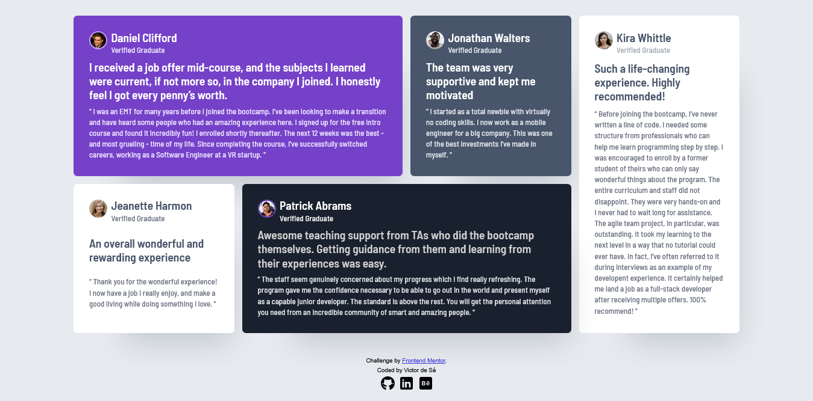
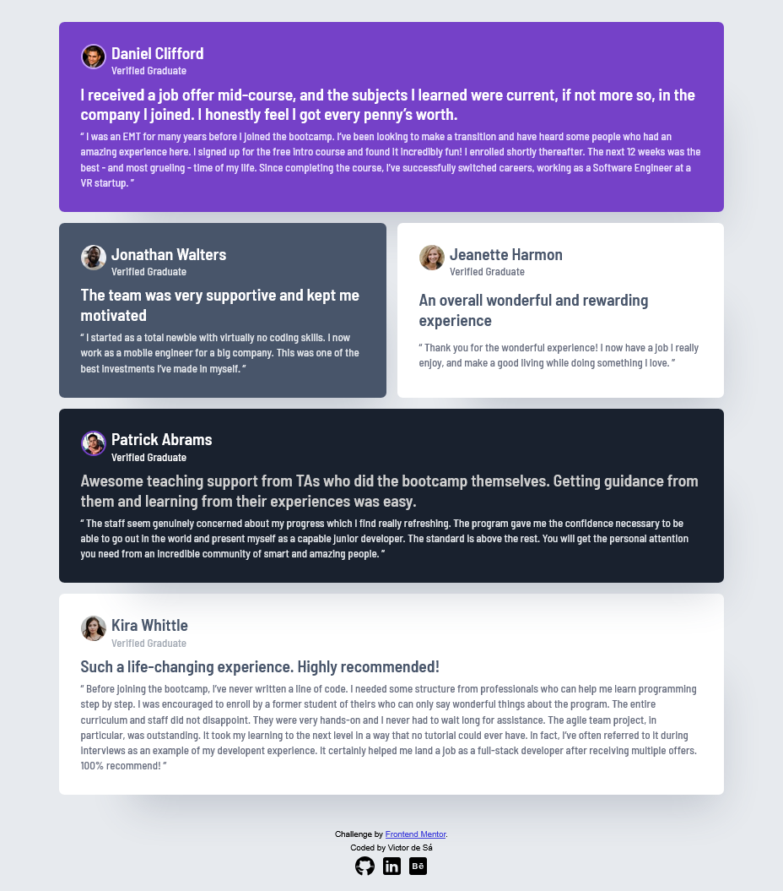
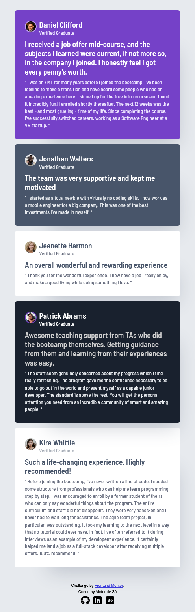

# Frontend Mentor | Testimonials Grid Section Challenge

Hi there, I'm Victor!
This is my solution to the [Testimonials Grid Section Challenge](https://www.frontendmentor.io/challenges/testimonials-grid-section-Nnw6J7Un7).

## Table of contents

- [Frontend Mentor | Testimonials Grid Section Challenge](#frontend-mentor---testimonials-grid-section-solution)
  - [Table of contents](#table-of-contents)
  - [Overview](#overview)
    - [Screenshot](#screenshot)
    - [Links](#links)
    - [Built with](#built-with)
    - [What I learned](#what-i-learned)
    - [Continued development](#continued-development)
    - [Useful resources](#useful-resources)
  - [Author](#author)

## Overview

The focus here was 100% on CSS Grid! This project served as a hands-on playground to practice all the essential concepts of this layout model: I explored everything from implicit tracks to the strategic use of grid areas.
To refine the result, I checked out Kevin Powell's solution and absorbed some valuable tricks on spacing and responsiveness—including the neat tip that you don't always need to apply padding to the body element. It was a great exercise in modern best practices!

### Screenshots

### Links

- Solution URL: [Testimonials Grid Section Solution Repository](https://github.com/victorudesa/frontend-mentor-challenges/tree/main/07-testimonials-grid-section/)
- Live Site URL: [Testimonials Grid Section Live Page](https://victorudesa.github.io/frontend-mentor-challenges/07-testimonials-grid-section/)

### Built with

- CSS Grid Layout
- CSS Custom Properties (Variables)
- Simple CSS Reset
- Responsive design using @media queries
- Advanced Selectors (e.g., :first-of-type, :last-of-type, Nesting)

### What I learned

* Reinforced and deepened my proficiency in Semantic HTML and accessibility practices, ensuring a robust document structure.
* Improved CSS architecture by incorporating BEM and ITCSS principles.
* Gained a deeper understanding of CSS Grid.
* Acquired best practices for spacing and layout, particularly regarding padding usage.

### Continued development

* Will continue to prioritize and apply CSS Grid in future projects.
* Plan to learn and experiment with a new CSS framework (e.g., Bootstrap or Tailwind).
* Will incorporate JavaScript to practice DOM manipulation.

### Useful resources

- [MDN - Grid](https://developer.mozilla.org/en-US/docs/Learn_web_development/Core/CSS_layout/Grids) - MDN is a cornerstone reference in web development, especially for best practices. This article, like many others from their website, made Grid a lot clearer.
- [W3 - CSS Variables](https://www.w3schools.com/css/css3_variables.asp) - The W3C is also a huge reference, and it's beneficial to draw knowledge from different sources.
- [Design Systems](https://www.designsystems.com/) - A great resource for understanding component structure and layout planning.
- [CSS Minimal Reset](https://www.digitalocean.com/community/tutorials/css-minimal-css-reset)

## Author

- [GitHub](https://github.com/victorudesa)
- [Behance](https://www.behance.net/victorurdesa)
- [LinkedIn](https://www.linkedin.com/in/victorudesa/)