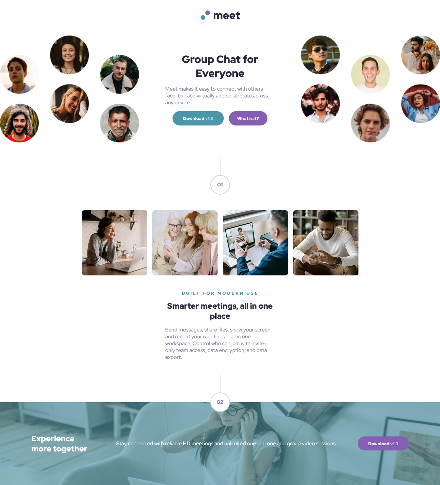
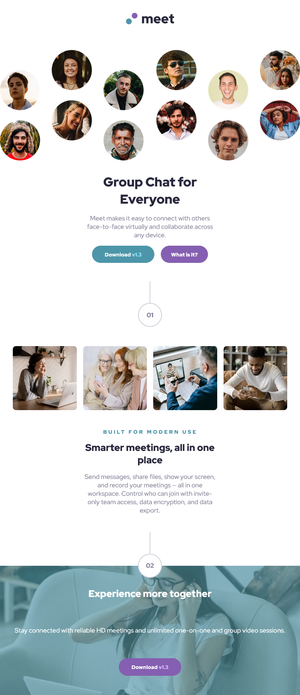

# Frontend Mentor | Meet Landing Page

Hi there, I'm Victor!
This is my solution to the [Meet Landing Page](https://www.frontendmentor.io/challenges/meet-landing-page-rbTDS6OUR).

## Table of contents

- [Frontend Mentor | Meet Landing Page](#frontend-mentor--meet-landing-page)
  - [Table of contents](#table-of-contents)
  - [Overview](#overview)
    - [Screenshots](#screenshots)
    - [Links](#links)
    - [Built with](#built-with)
    - [What I learned](#what-i-learned)
    - [Continued development](#continued-development)
    - [Useful resources](#useful-resources)
  - [Author](#author)

## Overview

This project served as an intensive deep dive into advanced, modern CSS techniques and methodologies. My primary focus was not just on matching the design, but on implementing a **fully responsive layout** using established **CSS Grid best practices** from a mobile-first perspective. This challenge was particularly valuable for solidifying component-based architecture and mastering subtle visual details using minimal HTML. It laid the groundwork for thinking about styling in a modular, highly maintainable way.

### Screenshots

### Links

- Solution URL: [Meet Landing Page Solution Repository](https://github.com/victorudesa/frontend-mentor-challenges/tree/main/08-meet-landing-page/)
- Live Site URL: [Meet Landing Page Live Page](https://victorudesa.github.io/frontend-mentor-challenges/08-meet-landing-page/)

### Built with

- CSS Grid Layout
- CSS Custom Properties (Variables)
- Simple CSS Reset
- Responsive design using @media queries
- Advanced Selectors (e.g., :first-of-type, :last-of-type, Nesting)
- OOCSS (Object-Oriented CSS) Methodology

### What I learned

* Methodology Adoption (OOCSS): Successfully implemented Object-Oriented CSS (OOCSS) for the first time, significantly improving modularity by clearly separating container and content styling rules.
* Advanced CSS Positioning: Mastered the use of the ::before pseudo-element combined with position: relative and position: absolute for creating and precisely placing complex decorative elements (like the pill dividers) without adding extra markup.
* Responsive Grid Mastery: Deepened my expertise in CSS Grid by applying advanced best practices to achieve a robust and complex, mobile-first responsive layout across multiple breakpoints.
* Layout and Spacing Logic: Refined my understanding of the Box Model, consistently applying margin-bottom on parent components for clear component separation and clean vertical flow.
* Modern Styling & Variables: Maintained a clean stylesheet architecture by leveraging CSS Custom Properties (Variables) and utilizing modern functions like filter: saturate() and rgba() for dynamic styling effects.

### Continued development

* Will continue to prioritize and apply CSS Grid in future projects.
* Plan to learn and experiment with a new CSS framework (e.g., Bootstrap or Tailwind).
* Will incorporate JavaScript to practice DOM manipulation.

### Useful resources

- [MDN - Grid](https://developer.mozilla.org/en-US/docs/Learn_web_development/Core/CSS_layout/Grids) - MDN is a cornerstone reference in web development, especially for best practices. This article, like many others from their website, made Grid a lot clearer.
- [W3 - CSS Variables](https://www.w3schools.com/css/css3_variables.asp) - The W3C is also a huge reference, and it's beneficial to draw knowledge from different sources.
- [Design Systems](https://www.designsystems.com/) - A great resource for understanding component structure and layout planning.
- [CSS Minimal Reset](https://www.digitalocean.com/community/tutorials/css-minimal-css-reset)

## Author

- [Frontend Mentor](https://www.frontendmentor.io/profile/victorudesa)
- [GitHub](https://github.com/victorudesa)
- [Behance](https://www.behance.net/victorurdesa)
- [LinkedIn](https://www.linkedin.com/in/victorudesa/)